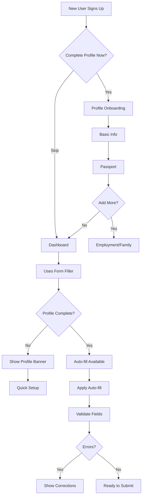

# Form Filler - User Profile Flow & Features

## 📊 Complete User Journey

### 1. **Initial Profile Setup (Optional Onboarding)**
- **When**: Right after account creation
- **Where**: `/app/profile-onboarding`
- **What happens**:
  - User sees benefits of profile setup (save time, prevent errors)
  - Can complete basic info (name, passport, nationality) in 2 minutes
  - Can skip and do later
  - Progressive steps: Personal → Passport → Employment (optional) → Family (optional)

### 2. **Progressive Profile Building**
- **First time using form filler**:
  - Prominent banner: "Set up profile for auto-fill"
  - Shows % completion and time savings potential
  - Quick setup button leads to onboarding flow

- **As they use different forms**:
  - System detects missing profile sections
  - Contextual prompts: "Add employment info for work visa auto-fill"
  - Just-in-time data collection

### 3. **Profile Access Points**

#### **A. Top-Right User Menu** (Always Accessible)
```
👤 John Doe ▼
├── Profile & Auto-fill
│   ├── Personal Information
│   └── Family Members
├── Account
│   ├── Settings
│   └── Billing
└── Logout
```

#### **B. Form Filler Page** (Context-Aware)
- Profile completion status card at top
- "Edit Profile" button for quick access
- "Auto-fill Form" button (shows % fillable)
- Quick add buttons for missing sections:
  - "+ Add Employment" (if no current job)
  - "+ Add Family Member" (if applying for family visa)
  - "+ Add Education" (if needed)

#### **C. Dedicated Settings Page** (`/app/profile-settings`)
- Full profile management interface
- Organized tabs:
  - Personal Info (name, DOB, nationality)
  - Passport (number, expiry, issuing country)
  - Employment (current & history)
  - Education (degrees, institutions)
  - Family (spouse, children, dependents)
- Visual completion indicators
- Data validation in real-time

### 4. **Family Member Management**
- **Add family members** anytime from:
  - Profile settings → Family tab
  - Form filler quick add button
  - User menu → Family Members

- **Per family member data**:
  - Basic info (name, DOB, nationality)
  - Passport details
  - Relationship to primary applicant
  - Minor status (for children)
  - Separate address if applicable

- **Auto-fill for family visas**:
  - Automatically populates spouse/children data
  - Handles multiple family members
  - Maintains relationship connections

### 5. **Smart Features**

#### **Auto-fill Intelligence**
- Recognizes field variations:
  - "surname" = "family_name" = "last_name"
  - "DOB" = "date_of_birth" = "birth_date"
- Shows confidence scores
- Highlights auto-filled vs manual fields

#### **Real-time Validation**
- Country-specific rules:
  - Singapore: Passport valid 6+ months, DD/MM/YYYY dates
  - USA: DS-160 requirements, social media history
  - Schengen: Travel insurance, proof of accommodation
- Instant error detection:
  - ❌ "Passport expires in 4 months, Singapore needs 6"
  - ⚠️ "Date format should be DD/MM/YYYY"
  - ✓ All validations passed

#### **Profile Persistence Benefits**
- **One-time entry**: Fill passport once, use everywhere
- **Cross-form reuse**: Singapore visa done? Thailand is 80% filled
- **Version history**: Track what data was used when
- **Family profiles**: Apply for multiple visas together

### 6. **User Experience Flow**



### 7. **Progressive Completion Strategy**

**Phase 1 - Essentials** (2 minutes)
- First name, last name
- Date of birth
- Nationality
- Email, phone

**Phase 2 - Passport** (1 minute)
- Passport number
- Issue/expiry dates
- Issuing country

**Phase 3 - Employment** (When needed)
- Current employer
- Job title
- Work address

**Phase 4 - Family** (When needed)
- Spouse details
- Children information

### 8. **Data Privacy & Security**
- All profile data encrypted at rest
- No sharing with third parties
- User can delete profile anytime
- Audit log of data usage
- GDPR compliant

## 🎯 Key Benefits Summary

1. **Time Savings**
   - First form: Save 10-15 minutes
   - Subsequent forms: Save 20-30 minutes
   - Family applications: Save 1+ hours

2. **Error Prevention**
   - Catches format errors before submission
   - Validates passport expiry requirements
   - Ensures field dependencies are met

3. **Convenience**
   - Access profile from any device
   - Edit once, updates everywhere
   - Family profiles for group travel

4. **Smart Assistance**
   - Country-specific validations
   - Format auto-correction
   - Missing field detection

## 📱 Implementation Status

✅ **Completed**:
- Database schema for profiles
- API endpoints for CRUD operations
- Profile onboarding flow
- Settings page with tabs
- User menu integration
- Auto-fill API with field mapping
- Validation rules engine
- Family member support
- Quick edit buttons in form filler

🚀 **Ready for Testing**:
- Complete user journey from signup to auto-fill
- Profile persistence across sessions
- Multi-country form support
- Family visa applications
- Real-time validation

This enhanced form filler transforms visa applications from hours of repetitive typing into a streamlined, error-free process that takes minutes!